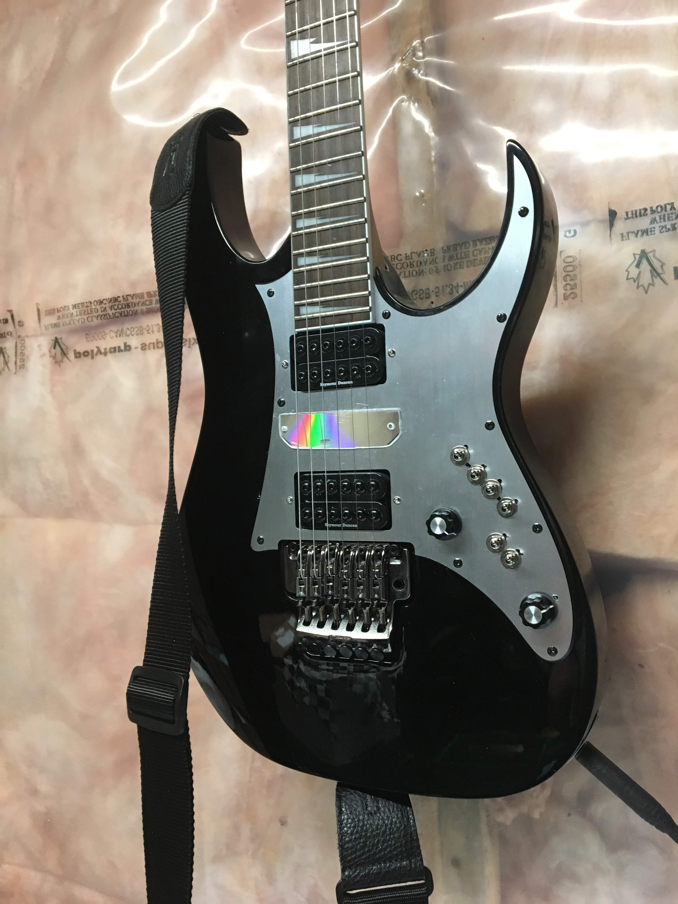
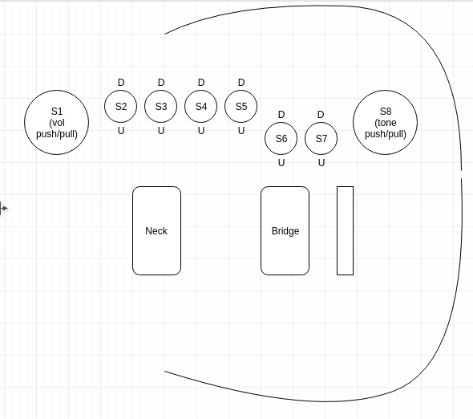
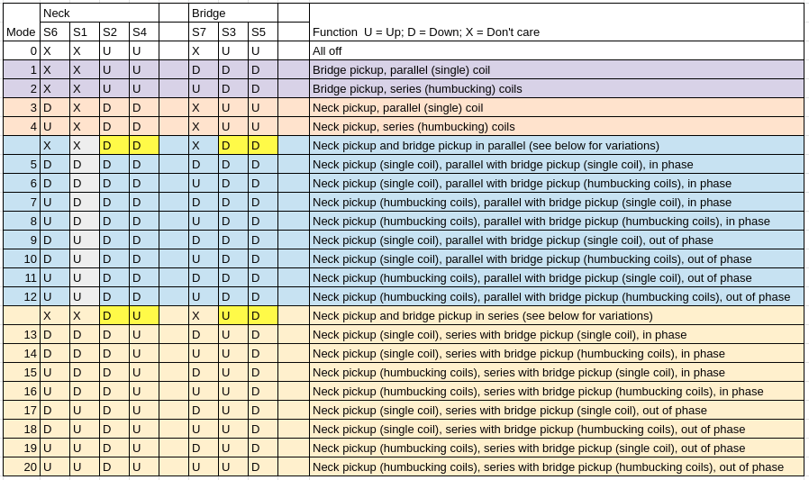
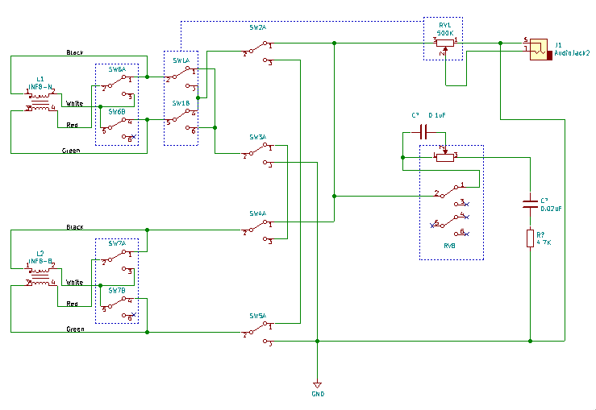

# Ibanez RG350EX

An Ibanez RG350EX with Seymour Duncan Invader pickups and custom wiring.

These switches allow for me to have 20 different configurations of the two pickups

* Just one pickup
* Both pickups, in series or parallel
* Phase reversing of the pickups
* Coil splitting (series or parallel)

I posted this in hopes it will be interesting or thought provoking to other musicians. And to welcome feedback for ideas to improve things.

If anything else an instruction manual for myself so I can always remember how my guitar works.

## Background

I got this in 2009 from Fleet Pro sound. I think for what ever reason I was missing my Mexican Strat after I sold it before moving back to Winnipeg following the intern at Nortel. By now I was back in Ottawa and had wanted to get back into Guitar.

I tried to get into playing it but it sounded terrible.

So it sat in the furnace room for like a decade.

Now I brought it out, changed the pickups and the wiring and it is awesome again.

## Switch Function

There are eight switches on the control panel.

Seven of the switches work to change the pickup configuration.

The eigth switch is a cut out for the tone circuit.

(diagram not to scale)

* six toggle switches.
* two push pull switches on the potentiometers.

Table 1 below explains what each switch does.

| Switch | Description                | Up | Down |
|:-------|:---------------------------|:---|:-----|
| S1     | Phase invert bridge pickup | Neck pickup phase is inverted from the bridge pickup | Neck pickup phase is the same as the bridge pickup |
| S2     | Neck pickup high side      | Connected to bridge low side | Connected to output
| S3     | Neck pickup low side       | Connected to bridge high side | Connected to ground
| S4     | Bridge pickup high side    | Connected to neck pickup low side | Connected to output |
| S5     | Bridge pickup low side     | Connected to neck pickup high side | Connected to ground |
| S6     | Neck coil split            | Nck pickup in series (humbuck) mode | Neck pickup in single (parallel) coil mode |
| S7     | Bridge coil split          | Bridge pickup in series (humbuck) mode | Bridge pickup in single (parallel) coil mode |
| S8     | Tone control               | Disable tone stack | Tone stack enabled |

And table 2 below explains the modes

There are 20 tone possibilities.

> This does not include the other permutation of having the pickups in series. The setup shown here with [S2, S4, S3, S5] i [D, U, U, D] has the bridge pickup connecting to the the output jack, then to the neck pickup, then to the ground.
>
> If we had [S2, S4, S3, S5] as [U, D, D, U] that would connect the bridge pickup to the output jack, then to the neck pickup, then to ground.
>
> However this is tonally identical, so the permutation was omitted.

## Schematic

For those interested.

The function of series/parallel for the pickups is done with S2, S3, S4, and S5. These are DPDT toggle switches, but I am only using 1 pole on each switch.

> This was just my idea for how to make two pick ups be
> * none
> * just one
> * just the other
> * both in parallel
> * both in series
>
> If you have any ideas for how I could do this better I am excited to learn.

The S6 and S7 used to be phase control switches. Where each pickup went into these to reverse the phase. I later realized that with only two pickups I do not require two switches. This was because my previous guitar had three pickups and I put in three phase switches, one for each pick up. But here with two pickups, if I move both switches the pick ups are just back in phase with each other again. So if I have only one switch then the pick ups will be out of phase, and it does not matter which pick up is the out of phase one. I moved the phase control switch to the S1 (the push/pull switch in the volume pot) and made these S6 and S7 be the coil split controls for each pickup.

I do not actually split the coils, just follow the Seymour Duncan wiring guide for series / parallel. Basically the white and red wires are not hard soldered to each other, but to the switch.

I wired the tone circuit to be a grease bucket tone mod (search the Internet). The S8 is not really needed if we crank the tone knob all the way off I find. I might rewire this later to do something else.

## Application

Some practical tone settings that are similar to other guitars or styles of playing.

| Mode                 | S1 | S2 | S3 | S4 | S5 | S6 | S7 | Notes |
|:---------------------|:--:|:--:|:--:|:--:|:--:|:--:|:--:|:------|
| A Stratocaster sound | D  | U  | D  | D  | D  | D  | D  | Just the bridge pick up, single coil mode |
| A Telecaster sound   | D  | D  | U  | D  | D  | D  | D  | Just the neck pickup, single coil mode |
| Heavy and Loud       | D  | D  | U  | U  | D  | U  | U  | Both pickups in humbuck mode and series |

I will expand the "sounds like a " table as I play with it more.