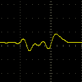

# Ibanez RG350EX

An Ibanez RG350EX with Seymour Duncan Invader pickups and custom wiring.

These switches allow for me to have 20 different configurations of the two pickups

* Just one pickup
* Both pickups, in series or parallel
* Phase reversing of the pickups
* Coil splitting (series or parallel)

I posted this in hopes it will be interesting or thought provoking to other musicians. And to welcome feedback for ideas to improve things.

If anything else an instruction manual for myself so I can always remember how my guitar works.

## Background

I got this in 2009 from Fleet Pro sound. I think for what ever reason I was missing my Mexican Strat after I sold it before moving back to Winnipeg following the intern at Nortel. By now I was back in Ottawa and had wanted to get back into Guitar.

I tried to get into playing it but it sounded terrible.

So it sat in the furnace room for like a decade.

Now I brought it out, changed the pickups and the wiring and it is awesome again.

## Switch Function

There are eight switches on the control panel.

Seven of the switches work to change the pickup configuration.

The eigth switch is a cut out for the tone circuit.

(diagram not to scale)

* six toggle switches.
* two push pull switches on the potentiometers.

Table 1 below explains what each switch does.

| Switch | Description                | Up | Down |
|:-------|:---------------------------|:---|:-----|
| S1     | Phase invert bridge pickup | Neck pickup phase is inverted from the bridge pickup | Neck pickup phase is the same as the bridge pickup |
| S2     | Neck pickup high side      | Connected to bridge low side | Connected to output
| S3     | Neck pickup low side       | Connected to bridge high side | Connected to ground
| S4     | Bridge pickup high side    | Connected to neck pickup low side | Connected to output |
| S5     | Bridge pickup low side     | Connected to neck pickup high side | Connected to ground |
| S6     | Neck coil split            | Nck pickup in series (humbuck) mode | Neck pickup in single (parallel) coil mode |
| S7     | Bridge coil split          | Bridge pickup in series (humbuck) mode | Bridge pickup in single (parallel) coil mode |

And table 2 below explains the modes

There are 20 tone possibilities.

> This does not include the other permutation of having the pickups in series. The setup shown here with [S2, S4, S3, S5] i [D, U, U, D] has the bridge pickup connecting to the the output jack, then to the neck pickup, then to the ground.
>
> If we had [S2, S4, S3, S5] as [U, D, D, U] that would connect the bridge pickup to the output jack, then to the neck pickup, then to ground.
>
> However this is tonally identical, so the permutation was omitted.

## Schematic

For those interested.

The function of series/parallel for the pickups is done with S2, S3, S4, and S5. These are DPDT toggle switches, but I am only using 1 pole on each switch.

> This was just my idea for how to make two pick ups be
>
> * none
> * just one
> * just the other
> * both in parallel
> * both in series
>
> If you have any ideas for how I could do this better I am excited to learn.

The S6 and S7 used to be phase control switches. Where each pickup went into these to reverse the phase. I later realized that with only two pickups I do not require two switches. This was because my previous guitar had three pickups and I put in three phase switches, one for each pick up. But here with two pickups, if I move both switches the pick ups are just back in phase with each other again. So if I have only one switch then the pick ups will be out of phase, and it does not matter which pick up is the out of phase one. I moved the phase control switch to the S1 (the push/pull switch in the volume pot) and made these S6 and S7 be the coil split controls for each pickup.

I do not actually split the coils, just follow the Seymour Duncan wiring guide for series / parallel. Basically the white and red wires are not hard soldered to each other, but to the switch.

I wired the tone circuit to be a grease bucket tone mod (search the Internet). The S8 is not really needed if we crank the tone knob all the way off I find. I might rewire this later to do something else.

## Application

Some practical tone settings that are similar to other guitars or styles of playing.

| Mode                 | S1 | S2 | S3 | S4 | S5 | S6 | S7 | Notes |
|:---------------------|:--:|:--:|:--:|:--:|:--:|:--:|:--:|:------|
| A Stratocaster sound | D  | U  | D  | D  | D  | D  | D  | Just the bridge pick up, single coil mode |
| A Telecaster sound   | D  | D  | U  | D  | D  | D  | D  | Just the neck pickup, single coil mode |
| Heavy and Loud       | D  | D  | U  | U  | D  | U  | U  | Both pickups in humbuck mode and series |

I will expand the "sounds like a " table as I play with it more.

## Waveform Analysis

Hooking the guitar directly up to an oscilloscope.
Trying to strike the low E string the same way each time.

## Single Pickup

The main difference here is changing the single coil to double coils

| Pickup | Single coil | Humbucking | Change |
|:-----|:---------|:------|:--|
| **Bridge** |  |  | S7 |
| **Neck**   |  |  | S6 |

## Pickups in Parallel

| Phase | Neck (S) Bridge (S) | Neck (S) Bridge (H) | Neck (H) Bridge (S) | Neck (H) Bridge (H) |
|:-|:-|:-|:-|:-|
| **In Phase** |  |  |  |  |
| **Out Phase** |  |  |  |  |

## Pickups in Series

| Phase | Neck (S) Bridge (S) | Neck (S) Bridge (H) | Neck (H) Bridge (S) | Neck (H) Bridge (H) |
|:-|:-|:-|:-|:-|
| **In Phase** |  |  |  |  |
| **Out Phase** |  |  |  |  |

## Custom Aluminum Pick Guard

I removed the middle pick up. I did not have any use for it. This left a hole where the pick up used to be. I tried covering it with shiny furnace pipe tape. And later a piece of a CD-ROM. But no matter what i did it looked pretty Ghetto.

If I could have built a sustainer pickup it would have fit nicely into the slot. But I have not been able to overcome several technical challenges of making this work. Mostly the magnetic fields from the coil in middle position interfere with the other pickups.

So I took the plastic pick guard to a water jet cutting place in town and had them make me a pick guard out of 1/8" aluminum. It had the same holes as the switch configurations from before too.

I attached the pick guard using some hex cap machine bolts that attach to wood screw ancher nuts in the body. I had to drill out a larger hole to screw the nuts into the body.

I liked the effect so much I went and modified my Fender Squire bass to be the same as well. I don't have a project for the bass, it just follows the evolution of the guitar.

The result is something I think is very visually stunning but also provides a bit more of a resonance to the sound of the guitar, I think anyway.

## Clean Boost Circuit

I built a clean boost based on the TL071 op-amp inside the guitar.

It is powered by a stereo jack. The ring connector on the TRS connector can supply 9V into the guitar. An internal DC-DC converter steps it up to 12V. The gain is fixed to be just about 1:1.

The motivation here is not to produce a louder output, but to convert the high impedence from the pickups into a low impedence signal to drive over the patchcord.

Even with the 20 foot patch cord I regularly use I can slightly hear a difference with the tonal quality and the sustain of some higher pitched notes when using the clean boost vs not using the clean boost.

The clean boost circuit facilitated upgrading the jack connector. I got a really good Switchcraft model. Which randomly did not come with the mounting hardware. A trip to the hardware store found some more special ass nut to fit it. And then more drilling to make it fit. The jack now holds the patch cord very well. And being fully shielded is less interface to pick up noise like the old one was.

## Locking tuners

I replaced the stock tuners with locking tuners. These allow me to wind the strings a little easier without needing to wind the string around a bunch of times. I don't really need them with the locking nut, but I was curious what they were about. I also wanted to replace the standard tuners because several of them had a lot of random backlash and that made tuning somewhat challenging.

## Actual Floyd Rose Trem

I got tired of the shitty edge trem. The tremmolo bar was so loose it was not even useable. The shitty zinc block under it was not very tonally pleasing to me. And the edges of the metal of the bridge against the posts were all shitty and worn in. Because its a shitty bridge.

The actual floyd rose trem has a good feel to it, I think. I got the fat brass sustain block to go with it, so more of a different sound from that as well. I first ordered the 37mm block, but it was just a bit too big to allow me to ge the back cover onto the guitar, and would touch your body as you played. I later ordered a 32mm block.